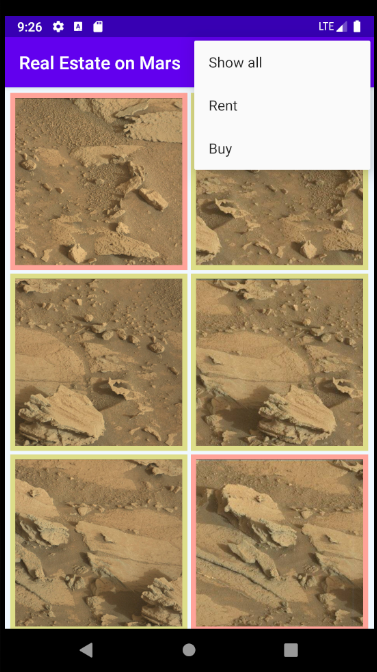
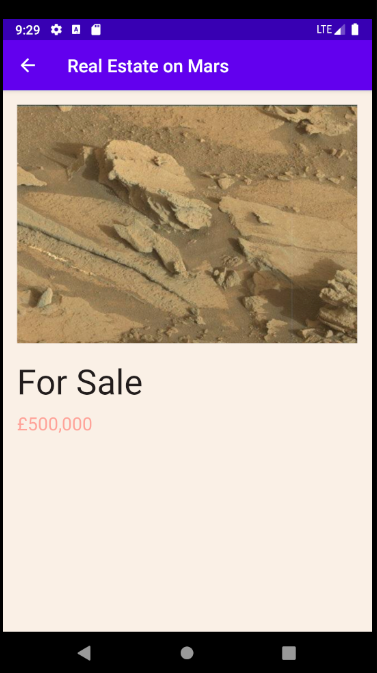
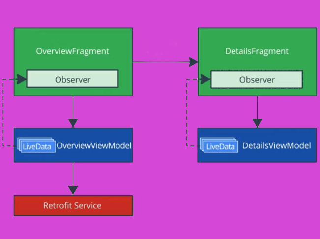

# MarsEstates
**Simple app built using Udacity's API with NASA photos which have a whimsical theme.**

 

This app demonstrates the following views and techniques:
* Retrofit to make api calls to an HTTP web service
* Moshi which handles the deserialization of the returned JSON to Kotlin data objects
* Glide to load and cache images by URL.

It leverages the following components from the Jetpack library:
* ViewModel
* LiveData
* Data Binding with binding adapters
* Navigation with the SafeArgs plugin for parameter passing between fragments

